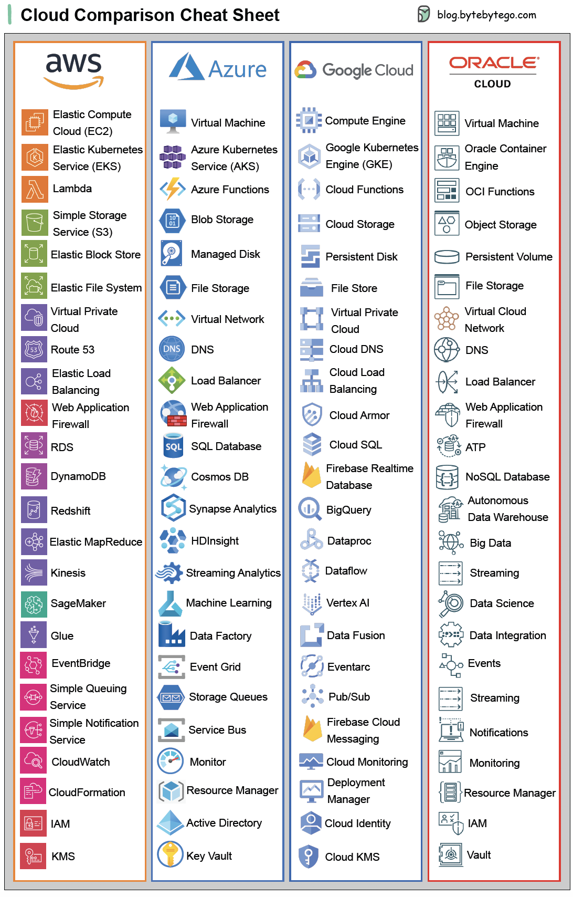

# Day 01 — Cloud Basics
Last modified: 19 Feb 2026

## What Is Cloud Computing
Cloud computing means renting IT resources (servers, storage, databases, networking, software) over the internet instead of owning physical hardware.

## Why We Use Cloud
- **Lower upfront cost**: Pay as you go instead of buying hardware.
- **Scalability**: Increase or decrease resources quickly.
- **Speed**: Launch services in minutes, not weeks.
- **Global reach**: Deploy in multiple regions worldwide.
- **Reliability**: Built‑in redundancy and high availability.

## Core Characteristics of Cloud
These three are essential characteristics of cloud services:
- **Elasticity**: Automatically add/remove resources based on demand.
  - Example: Auto Scaling adds EC2 instances when traffic spikes.
- **Scalability**: Ability to grow resources to meet long‑term demand.
  - Example: Move from a small EC2 instance to a larger one, or add more instances.
- **High Availability**: Services stay up even if a component fails.
  - Example: Deploy instances across multiple AZs in a Region.

## Why Use AWS
- Largest service catalog and global infrastructure.
- Strong ecosystem, documentation, and community.
- Mature security and compliance options.

## Cloud Service Models
- 
- **IaaS (Infrastructure as a Service)**: You manage OS, apps, and data; provider manages hardware.
  - Example: AWS EC2.
- **PaaS (Platform as a Service)**: Provider manages OS and runtime; you deploy code.
  - Example: AWS Elastic Beanstalk.
- **SaaS (Software as a Service)**: Fully managed software delivered over the internet.
  - Example: Gmail or Salesforce.

## Market Leaders (Top CSPs)
- **AWS** (Amazon Web Services)
- **Microsoft Azure**
- **Google Cloud Platform (GCP)**

## Cloud Comparison Cheat Sheet
This chart gives a quick side-by-side view of major cloud providers and helps map similar services across platforms.

## Quick Summary
Cloud lets you rent compute, storage, and networking on demand. AWS is a market leader with broad services and global coverage.
