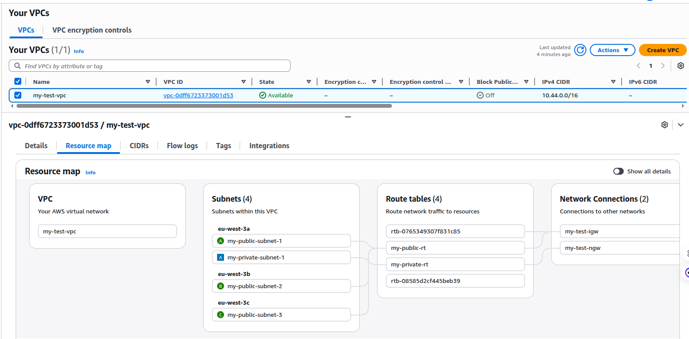
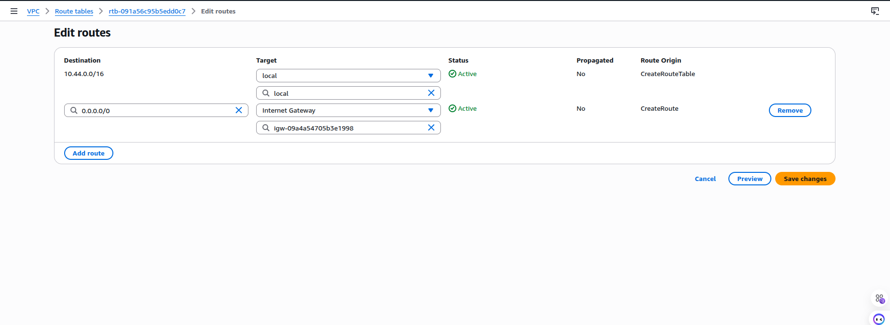
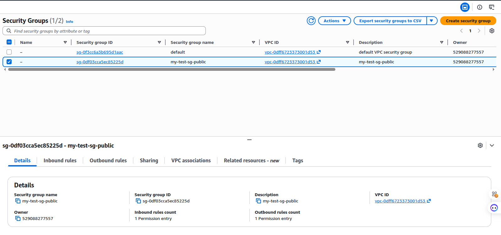

# Day 02 — AWS SAA-C03 Notes
Last modified: 10 Feb 2026

## Regions and AZs
- **Region**: A geographic area that contains multiple Availability Zones. Choose based on latency, cost, and compliance.
  - Example: `us-east-1` (N. Virginia).
- **Availability Zone (AZ)**: One or more data centers within a Region. AZs are isolated but connected by low‑latency links.
  - Example: `us-east-1a`, `us-east-1b`.

## VPC and CIDR
- **VPC (Virtual Private Cloud)**: A logically isolated network in AWS where you define your IP range and network setup.
  - Example: Create a VPC with CIDR `10.0.0.0/16`.
- **CIDR Range**: IP address block that defines the size of a network.
  - Example: `10.0.0.0/16` gives 65,536 IPs.

## CIDR and Basic Networking (Quick Math)
- **CIDR format**: `IP/prefix` where prefix is number of network bits.
  - Example: `10.0.0.0/16` means first 16 bits are network, remaining 16 bits are host.
- **Total IPs**: `2^(32 - prefix)` for IPv4.
  - Example: `/24` → `2^(32-24) = 256` IPs.
- **Usable IPs in AWS**: Total minus 5 reserved by AWS.
  - Example: `/24` → 256 total, 251 usable.
- **Common sizes**:
  - `/16` → 65,536 total (65,531 usable)
  - `/20` → 4,096 total (4,091 usable)
  - `/24` → 256 total (251 usable)
- **Subnetting example**: Split `10.0.0.0/16` into four `/18` subnets.
  - `10.0.0.0/18`
  - `10.0.64.0/18`
  - `10.0.128.0/18`
  - `10.0.192.0/18`
- **Public/private split example**:
  - Public: `10.0.1.0/24`, `10.0.2.0/24`
  - Private: `10.0.101.0/24`, `10.0.102.0/24`

## Subnets
- **Subnet**: A smaller network inside a VPC. Each subnet lives in one AZ.
  - Example: Split `10.0.0.0/16` into:
  - Public subnet: `10.0.1.0/24` (AZ-a)
  - Private subnet: `10.0.2.0/24` (AZ-a)
  - Another public subnet: `10.0.3.0/24` (AZ-b)
  - Another private subnet: `10.0.4.0/24` (AZ-b)
- **Public Subnet**: Has a route to the Internet via an Internet Gateway.
- **Private Subnet**: No direct route to the Internet.

## Why Public vs Private Subnet (Not Just a Name)
- **Public subnet**: Route table includes `0.0.0.0/0 -> IGW`. Instances can be reachable from the internet if they have a public IP and security group allows.
- **Private subnet**: No IGW route in its route table. Instances are not directly reachable from the internet.
- **Why we need both**:
  - **Public** for web servers, bastion hosts, load balancers.
  - **Private** for databases, internal services, backend systems.
  - **Outbound only** for private subnets is done via a NAT Gateway in a public subnet.

## Route Tables
- **Route Table**: Controls where network traffic is directed.
  - Example public route table:
  - `10.0.0.0/16 -> local`
  - `0.0.0.0/0 -> Internet Gateway (IGW)`
  - Example private route table:
  - `10.0.0.0/16 -> local`

## Internet Gateway (IGW)
- **IGW**: Allows internet access for resources in public subnets.
  - Example: Attach IGW to VPC, then add `0.0.0.0/0` to the public route table.

## EC2 and IPs
- **EC2**: Virtual server instance you launch inside a subnet.
- **Private IP**: Internal IP used inside the VPC.
  - Example: `10.0.1.10`
- **Public IP**: Internet‑reachable IP assigned to an instance in a public subnet.
  - Example: `3.88.x.x`
- **Elastic IP (EIP)**: Static public IP you can attach to an instance so it doesn’t change.

## Access and Security
- **Key Pair**: Used to SSH into EC2.
  - Example: `ssh -i my-key.pem ec2-user@3.88.x.x`
- **Security Group**: Virtual firewall attached to instances.
  - **Inbound Rules**: Control incoming traffic.
    - Example: Allow `SSH (TCP 22)` from your IP.
  - **Outbound Rules**: Control outgoing traffic.
    - Example: Allow all outbound.

## Associations (Important)
- **Public subnet → Public route table** (route to IGW).
- **Private subnet → Private route table** (no IGW route).
