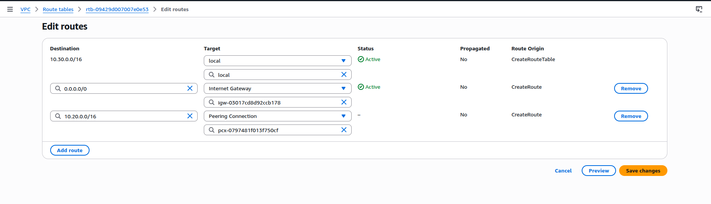
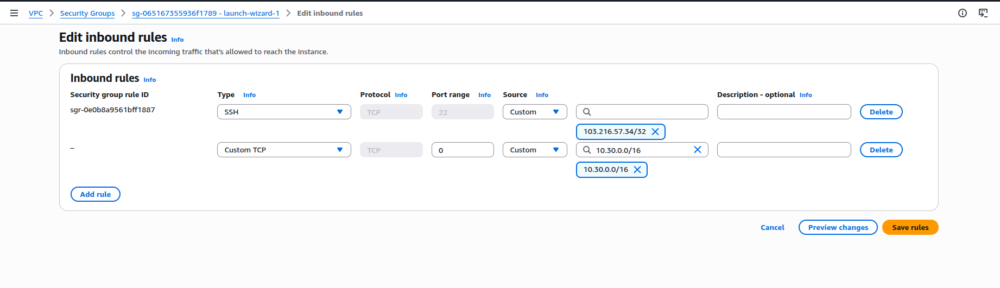
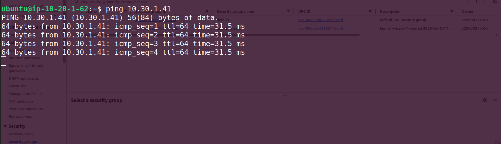

# Day 04 - VPC Peering

Last modified: 19 Feb 2026

## What is VPC Peering?
VPC Peering is a **private network connection** between two VPCs.  
It allows resources in one VPC to communicate with resources in another VPC using **private IP addresses**.

- Traffic stays on the AWS backbone network (not public internet)
- Communication is direct between peered VPCs
- It works across same account, different accounts, and even different regions (inter-region peering)

---

## Why do we need VPC Peering?
We use VPC Peering when we want two isolated VPC networks to talk to each other securely.

Common use cases:
- One VPC hosts application servers, another hosts database servers
- Dev/Test VPC needs controlled access to Shared Services VPC
- Different teams/accounts need private connectivity between their VPC resources

Benefits:
- Private communication (better security)
- Low latency and high bandwidth inside AWS network
- No need for VPN or internet gateway for VPC-to-VPC traffic

---

## How VPC Peering works (simple flow)
1. Create a peering connection request from VPC-A to VPC-B  
2. Owner of VPC-B accepts the request  
3. Add routes in both VPC route tables to send peer CIDR traffic via peering connection  
4. Update Security Groups (and NACL if needed) to allow required traffic  

After these are done, EC2 instances in both VPCs can communicate privately.

> Important: VPC Peering is **non-transitive**.  
> If A is peered with B, and B is peered with C, A cannot automatically talk to C through B.

---

## My 4-Step Configuration (Hands-on)

### Step 1: Create VPC Peering Connection
- Go to **VPC Console -> Peering Connections -> Create peering connection**
- Select:
  - Requester VPC: `VPC-A`
  - Accepter VPC: `VPC-B`
- Create request

Request will show status as pending acceptance:

---

### Step 2: Accept Peering Request
- Open peering request from VPC-B side/account
- Click **Accept request**
- Status should become **Active**

---

### Step 3: Update Route Tables in Both VPCs
Now both VPC route tables must know how to reach each other.

- In **VPC-A route table**:
  - Destination: `CIDR of VPC-B`
  - Target: `Peering Connection (pcx-xxxx)`

- In **VPC-B route table**:
  - Destination: `CIDR of VPC-A`
  - Target: `Peering Connection (pcx-xxxx)`

---

### Step 4: Allow Traffic in Security Groups (Both EC2s)
Even if peering + routes are correct, SG can still block traffic.

- On EC2 in VPC-A SG: allow inbound from VPC-B CIDR (or specific SG/IP)
- On EC2 in VPC-B SG: allow inbound from VPC-A CIDR (or specific SG/IP)
- For test, allow ICMP (ping) between both private IP ranges

---

## Verification
After 4 steps, test connectivity:

- Ping from EC2 in VPC-A to private IP of EC2 in VPC-B
- Ping from EC2 in VPC-B to private IP of EC2 in VPC-A

If ping fails, check in this order:
1. Peering status is Active
2. Both route tables have peer CIDR entry
3. SG inbound/outbound rules allow required protocol/port
4. NACL rules allow traffic
5. EC2 source/destination private IPs are correct

---

## Key Points to Remember
- VPCs must have **non-overlapping CIDR blocks**
- Peering is **one-to-one** and **non-transitive**
- Route tables must be updated on **both sides**
- Security Groups/NACL still apply after peering
