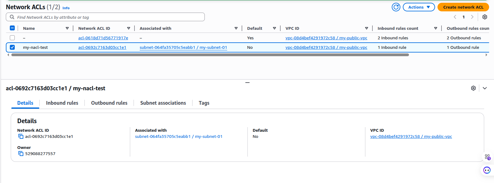

# Day 05 - EC2 Instance Purchase Options / Launch Template / NACL

Last modified: 23 Feb 2026

Amazon EC2 offers a variety of pricing models for different needs. These models allow users to optimize costs based on workload, budget, and usage patterns.

## 1) On-Demand Instances
On-Demand instances are the most flexible pricing option. You only pay for the computing capacity you use, with no long-term commitments. This option is perfect for workloads that are unpredictable.

- Use case: Best for applications with variable workloads and testing environments.
- Key features: No upfront costs, flexible scaling, and easy to adjust as per your requirements.

## 2) Reserved Instances (RIs)
Reserved Instances offer significant savings (up to 75%) over On-Demand pricing if you commit to using EC2 for 1 or 3 years. This model allows you to reserve capacity in specific availability zones and lock in a discounted rate.

- Use case: Best for predictable, steady workloads.
- Key features: Discounted pricing for long-term commitment, capacity reservation.

## 3) Spot Instances
Spot Instances let you use unused EC2 capacity at a lower price, offering savings of up to 90% compared to On-Demand pricing. However, the downside is that AWS can terminate Spot Instances with short notice (usually 2 minutes), so they are best for flexible and fault-tolerant applications.

- Use case: Ideal for cost-sensitive applications that can handle interruptions.
- Key features: Significant cost savings, flexible start/end times.

## 4) Dedicated Hosts
Dedicated Hosts provide physical EC2 servers for your exclusive use, which is useful for customers with specific compliance requirements or those who want to use their existing software licenses. Unlike other EC2 instances, a Dedicated Host gives you more control over the server.

- Use case: Suitable for running workloads that require dedicated resources and compliance with licensing.

## 5) Savings Plans
Savings Plans provide savings beyond On-Demand rates in exchange for a commitment of using a specified amount of compute power (measured per hour) for a one or three year period.

When you sign up for Savings Plans, the prices you'll pay for usage stays the same through the plan term. You can pay for your commitment using All upfront, Partial upfront, or No upfront payment options.

## Launch Template
A Launch Template lets you save a standard EC2 instance configuration (AMI, instance type,Subnet,vpc, key pair, security groups, storage, and more). Instead of repeating the same setup each time, you can reuse the template to launch instances quickly and consistently.

## NACL and Security Groups

NACL (Network ACL) and Security Group (SG) are both AWS network security layers, but they work differently.

- NACL works at the subnet level and is stateless.
- Security Group works at the instance level and is stateful.
- NACL supports both allow and deny rules.
- Security Group supports allow rules only (no explicit deny).
- NACL can filter traffic by specific IP or CIDR ranges.

### How NACL Rule Numbers Work
- Rule numbers define the order of evaluation (lowest number first).
- AWS checks rules from low to high and stops at the first match.
- The first matching rule is applied (ALLOW or DENY).
- Keep number gaps like 100, 200, 300 so new rules can be inserted later.

Example:
- Rule 99: DENY ICMP from `0.0.0.0/0`
- Rule 100: ALLOW ICMP from `0.0.0.0/0`
- Result: traffic is denied because rule 99 is matched first.

### SG Allow (No NACL Restriction)
In this step, the Security Group allows ICMP/ping traffic. Since no restrictive NACL rule is applied yet, connectivity works.

### NACL Inbound Rule
Here, the inbound NACL rule is configured to control incoming traffic at the subnet level.

### NACL Outbound Rule
 NACL rule configuration, which controls subnet-level outgoing traffic.

### NACL Subnet Association
After creating the NACL rules, the NACL is associated with the target subnet so the rules can take effect.

### Result After NACL Rule Applied
Final result: after applying restrictive NACL rules, ping traffic is blocked. This demonstrates that NACL can explicitly deny traffic, unlike Security Groups.

 ## Reference
- https://docs.aws.amazon.com/ (Official documents of AWS)
