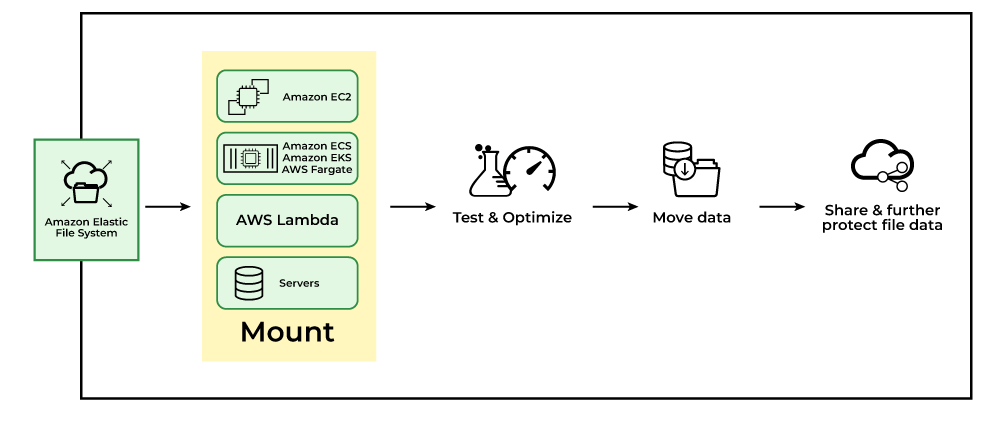

# EFS - Elastic File System
Last modified: 10 Apr 2026

## What is EFS?
EFS (Elastic File System) is AWS's **scalable file storage service** for EC2 instances.  
It provides a simple, scalable, elastic file system for Linux-based workloads.

- Shared file storage accessible by multiple EC2 instances
- Automatic scaling from gigabytes to petabytes
- Supports NFSv4 protocol
- High availability and durability across multiple AZs

### Basics of EFS
The image below shows how EFS integrates with EC2 instances.

---

## Why do we need EFS?
We use EFS for shared file storage that needs to be accessed by multiple instances or containers.

Common use cases:
- Content management systems with multiple web servers
- Big data analytics with shared datasets
- Containerized applications needing persistent storage
- Home directories for users across multiple instances
- Backup and disaster recovery solutions

Benefits:
- Elastic capacity that grows and shrinks automatically
- Concurrent access from thousands of EC2 instances
- Strong consistency and file locking
- Integration with other AWS services

---

## How EFS works (simple flow)
1. Create an EFS file system in your VPC
2. Mount targets are created in each AZ
3. EC2 instances mount the file system using NFS
4. Data is automatically replicated across AZs
5. Storage capacity scales as you add files

After setup, multiple EC2 instances can access the same files simultaneously.

> Important: EFS is **regional** and accessible across multiple AZs.  
> It's not suitable for Windows-based workloads (use FSx for Windows instead).

---

## My 4-Step Configuration (Hands-on)

### Step 1: Create EFS File System
- Go to **EFS Console -> Create file system**
- Choose VPC and create mount targets in subnets
- Configure security groups for NFS access

### Step 2: Mount on EC2 Instance
- Connect to EC2 instance via SSH
- Install NFS client if needed
- Mount the file system using mount command

### Step 3: Configure Permissions
- Set file system policies for access control
- Configure POSIX permissions on directories
- Enable encryption at rest and in transit

### Step 4: Test and Monitor
- Create test files and verify access from multiple instances
- Monitor performance metrics in CloudWatch
- Set up lifecycle policies for cost optimization