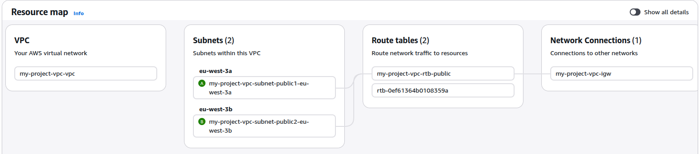
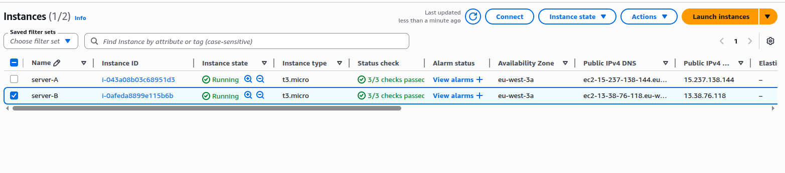
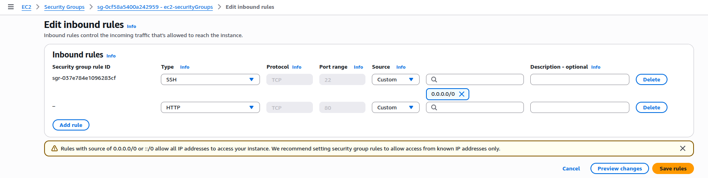
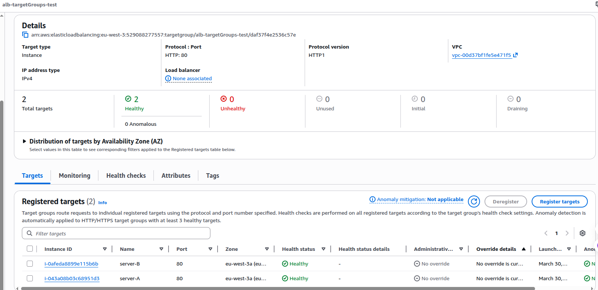
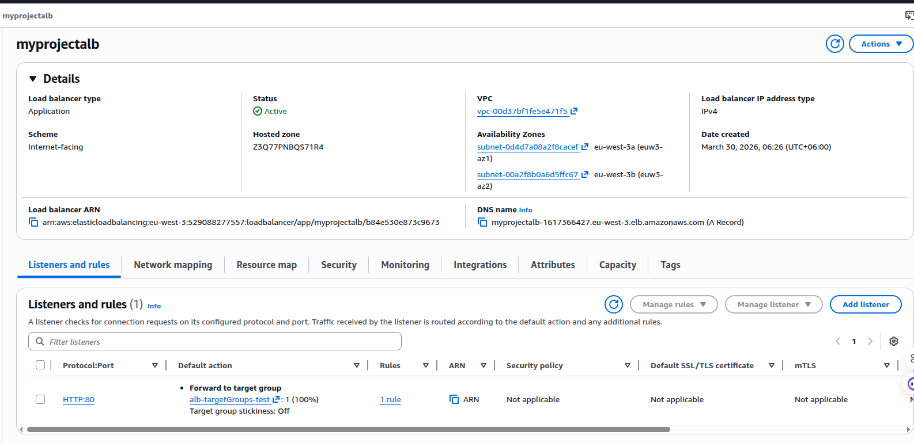
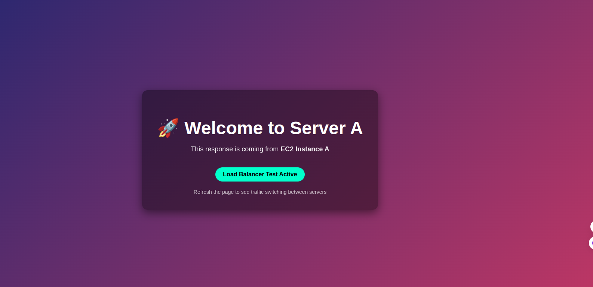
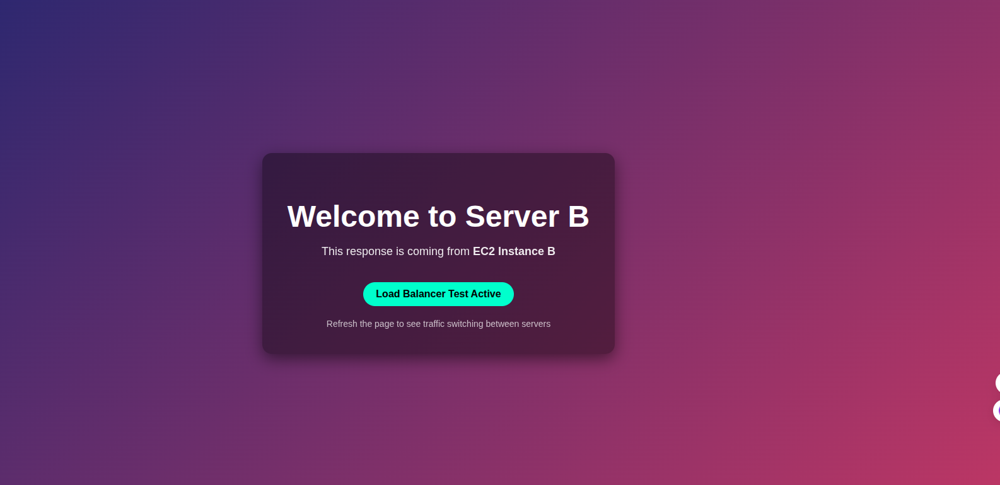

# Elastic Load Balancers (ELB)
Last modified: 30 Mar 2026

## What Is a Load Balancer
A load balancer is a service that receives client traffic and distributes it across multiple servers (targets), so no single server is overloaded.

## Why We Need Load Balancer
- **High availability**: If one server fails, traffic goes to healthy servers.
- **Scalability**: Handle more users by adding more instances behind one endpoint.
- **Better performance**: Distribute requests to reduce response delays.
- **Single entry point**: Users access one DNS name instead of many server IPs.

## Challenges Without Load Balancer
- Single server becomes a **single point of failure**.
- Traffic spikes can **overload one instance**.
- Users must know multiple server IPs or endpoints.
- Hard to perform maintenance without service impact.
- Uneven traffic distribution causes poor user experience.

## How Load Balancer Solves These Challenges
- Continuously checks target health and sends traffic only to healthy targets.
- Spreads requests across multiple instances.
- Provides one stable DNS endpoint for clients.
- Supports rolling updates and scale-out with less interruption.
- Improves fault tolerance across multiple Availability Zones.

## 4 Types of Elastic Load Balancer in AWS

### 1) Application Load Balancer (ALB)
- Works at **Layer 7 (HTTP/HTTPS)**.
- Supports host-based and path-based routing.
- Best for web apps, APIs, and microservices.
- **Use when**: Smart routing rules are required, such as `/api` vs `/app` or different subdomains.

### 2) Network Load Balancer (NLB)
- Works at **Layer 4 (TCP/UDP/TLS)**.
- Very high performance and ultra-low latency.
- Supports static IP and handles sudden traffic spikes.
- **Use when**: Very fast transport-layer load balancing or non-HTTP protocols are required.

### 3) Gateway Load Balancer (GWLB)
- Used to deploy and scale **network/security virtual appliances**.
- Common for traffic inspection, firewall, IDS/IPS chains.
- **Use when**: Centralized security inspection is required in a VPC architecture.

### 4) Classic Load Balancer (CLB)
- Legacy load balancer (older generation).
- Supports basic Layer 4/7 features but less advanced than ALB/NLB.
- **Use when**: Legacy environments still depend on CLB.

## Quick Decision: Which ELB When?
- **Choose ALB** for HTTP/HTTPS apps, path/host routing, microservices.
- **Choose NLB** for ultra-low latency, TCP/UDP, static IP, very high performance.
- **Choose GWLB** for security appliance insertion and traffic inspection.
- **Choose CLB** only for legacy workloads.

## Practical: Application Load Balancer (ALB) Lab

### Goal
Create an ALB that distributes traffic between two EC2 web servers and verify both targets serve responses.

### ALB Subnet Requirement
- ALB should be attached to **at least 2 subnets** in **2 different Availability Zones** for high availability.
- For internet-facing ALB, these are typically public subnets.

### Architecture Summary
- One VPC with subnets in at least two AZs.
- Two EC2 instances running simple web pages.
- Security groups allowing required HTTP/SSH access.
- One target group with both EC2 instances.
- One internet-facing ALB with listener on HTTP (port 80).

### Prerequisites
- VPC and subnet design ready.
- Two EC2 instances are running.
- EC2 security group allows HTTP (80) only from the ALB security group.
- Each server serves different content (example: Server A and Server B welcome pages).

### Step 1: Verify VPC and Subnet Layout
Use a proper VPC layout before creating ALB.

### Step 2: Confirm Two EC2 Instances Are Running
Make sure both backend instances are up.

### Step 3: Check EC2 Security Group Rules
Ensure EC2 inbound HTTP (80) source is set to the ALB security group.

### Step 4: Create Target Group and Register Instances
- Go to EC2 Console -> Target Groups -> Create target group.
- Target type: `Instances`.
- Protocol/Port: `HTTP : 80`.
- Register both EC2 instances.
- Confirm health checks are passing.

### Step 5: Create Application Load Balancer
- Go to EC2 Console -> Load Balancers -> Create load balancer -> Application Load Balancer.
- Scheme: `Internet-facing`.
- Select at least two public subnets (different AZs).
- Attach ALB security group.
- Listener: `HTTP : 80`.
- Default action: forward to the target group.

### Step 6: Test ALB DNS Name
Open the ALB DNS name in browser multiple times/curl to verify traffic reaches targets.

Server A response example:

Server B response example:

## Verification Checklist
- ALB status is `Active`.
- Target group shows both targets as `Healthy`.
- Opening ALB DNS returns responses from backend servers.
- ALB security group allows HTTP (80) from clients, and EC2 security group allows HTTP (80) only from ALB security group.

## Basic Troubleshooting
- **Targets unhealthy**: Check EC2 app status, health check path/port, and SG/NACL rules.
- **Timeout from ALB DNS**: Verify ALB is internet-facing and subnets/routes are correct.
- **Only one server response seen**: Repeat requests; verify both instances are registered and healthy.
- **403/connection issues**: Recheck listener rules and target group association.