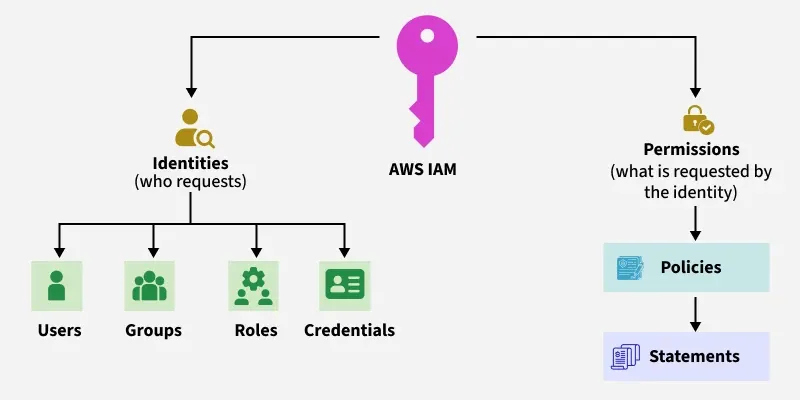

# IAM - Identity and Access Management
Last modified: 19 Apr 2026

## What is IAM?
IAM (Identity and Access Management) is AWS's service for **managing access to AWS services and resources**.  
It allows you to control who can access what, and under what conditions.

- Users, groups, and roles for identity management
- Policies to define permissions
- Multi-factor authentication (MFA) for enhanced security
- Integration with AWS services and external identity providers

### Basics of IAM

---

## Why do we need IAM?
We use IAM to secure our AWS environment by implementing the principle of least privilege.

Common use cases:
- Grant specific permissions to developers for EC2 and S3 access
- Create roles for applications running on EC2 to access other AWS services
- Enable cross-account access for shared resources
- Implement temporary credentials for enhanced security

Benefits:
- Granular access control
- Centralized management of permissions
- Audit trail of user activities
- Compliance with security best practices

---

## How IAM works (simple flow)
1. Create IAM users or roles with appropriate policies
2. Assign permissions using managed or custom policies
3. Users authenticate using access keys, passwords, or temporary credentials
4. AWS evaluates policies to determine access rights
5. Actions are logged in CloudTrail for auditing

After setup, users can securely access AWS resources based on their assigned permissions.

> Important: IAM is **global** and not region-specific.  
> Changes to IAM affect the entire AWS account.

---

## What is a Policy?
A policy is a **JSON document** that defines permissions for accessing AWS resources.  
It specifies what actions are allowed or denied on which resources.

- Policies are attached to users, groups, or roles
- They follow the principle of least privilege
- Can be AWS managed or customer managed
- Support conditions for fine-grained control

### Basics of Policies
Policies contain statements with Effect (Allow/Deny), Action, Resource, and optional Condition.

---

## Types of Policies
There are several types of IAM policies:

### 1. Identity-based Policies
- Attached to IAM identities (users, groups, roles)
- Control what the identity can do
- Examples: AmazonEC2FullAccess, custom policies

### 2. Resource-based Policies
- Attached to AWS resources (S3 buckets, SQS queues, etc.)
- Control who can access the resource
- Examples: S3 bucket policies, VPC endpoint policies

### 3. Permissions Boundaries
- Set maximum permissions for an identity
- Prevent privilege escalation
- Used with roles and users

### 4. AWS Managed Policies
- Created and managed by AWS
- Updated automatically by AWS
- Examples: AdministratorAccess, ReadOnlyAccess

### 5. Customer Managed Policies
- Created and managed by you
- Full control over permissions
- Reusable across multiple identities

---

## What is a Role?
A role is an **IAM identity** that you can create in your account with specific permissions.  
It doesn't have long-term credentials like users do.

- Roles are assumed by users, applications, or services
- Provide temporary security credentials
- Used for cross-account access and service permissions
- Support trust policies to define who can assume the role

### Types of Roles
- **Service Roles**: For AWS services (e.g., EC2 instance role)
- **Cross-Account Roles**: For access between accounts
- **Web Identity Roles**: For users authenticated via identity providers
- **SAML Roles**: For federated users from SAML providers