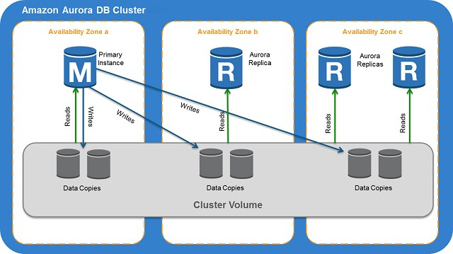

# RDS and Aurora
Last modified: 05 May 2026

## What is Amazon RDS?
Amazon RDS (Relational Database Service) is a managed relational database service from AWS.
It helps you run databases without managing most of the underlying infrastructure.

RDS supports popular database engines:
- Amazon Aurora
- MySQL
- PostgreSQL
- MariaDB
- Oracle
- Microsoft SQL Server

AWS manages common database tasks such as:
- Hardware provisioning
- Database patching
- Backups
- Monitoring
- Multi-AZ high availability
- Storage scaling

RDS is commonly used for web applications, ecommerce systems, enterprise applications, and backend services that need structured relational data.

---

## What is Amazon Aurora?
Amazon Aurora is a cloud-optimized relational database engine built by AWS.
It is compatible with **MySQL** and **PostgreSQL**, but designed to provide better performance, availability, and scalability than standard open-source databases.

Aurora is part of Amazon RDS, but it has its own distributed storage architecture.

Key points:
- Compatible with MySQL and PostgreSQL
- Storage automatically grows up to 128 TiB
- Replicates data across 3 Availability Zones
- Supports fast failover
- Supports read replicas with low replication lag
- Designed for high performance and high availability

---

## Read Replicas
Read replicas are copies of the primary database used to handle read traffic.

How it works:
- The primary database handles writes
- Data is asynchronously replicated to read replicas
- Applications send read queries to replicas
- Write queries still go to the primary database

Benefits:
- Improves read scalability
- Reduces load on the primary database
- Useful for reporting and analytics queries
- Can be used for cross-Region disaster recovery

Important points:
- Read replicas are for **read scaling**, not automatic high availability
- Replication is usually asynchronous, so there can be replication lag
- Some engines allow promoting a read replica to a standalone database
- Multi-AZ is for high availability, while read replicas are for performance scaling

---

## RDS Proxy
RDS Proxy is a managed database proxy for Amazon RDS and Aurora.
It sits between the application and the database.

Main purpose:
- Pool and reuse database connections
- Reduce database connection overhead
- Improve application availability during failover
- Protect the database from connection storms

Common use cases:
- Lambda functions connecting to RDS
- Applications with many short-lived connections
- Workloads with sudden traffic spikes
- Applications that need better failover handling

Benefits:
- Improves scalability
- Reduces database CPU and memory pressure
- Stores credentials securely with AWS Secrets Manager
- Supports IAM database authentication
- Helps applications recover faster from database failover

---

## Benefits of RDS
RDS reduces the operational work needed to run relational databases.

Key benefits:
- **Managed service**: AWS handles infrastructure tasks.
- **Automated backups**: Supports point-in-time recovery.
- **Multi-AZ deployment**: Provides high availability with automatic failover.
- **Read replicas**: Improves read performance.
- **Monitoring**: Integrates with CloudWatch and Performance Insights.
- **Security**: Supports encryption, IAM, security groups, and private subnets.
- **Scaling**: Allows compute and storage scaling.
- **Patching**: AWS can manage database engine updates.

---

## Aurora Architecture
Aurora uses a cluster-based architecture.

The image below shows the basic Aurora architecture.

Main components:
- **DB cluster**: The main Aurora database environment.
- **Writer instance**: Handles writes and can also serve reads.
- **Reader instances**: Handle read-only traffic.
- **Cluster endpoint**: Connects to the current writer instance.
- **Reader endpoint**: Load balances read traffic across Aurora Replicas.
- **Distributed storage volume**: Shared storage layer used by all instances in the cluster.

Simple flow:
1. Application sends writes to the Aurora cluster endpoint
2. Writer instance processes write operations
3. Data is stored in Aurora's distributed storage layer
4. Reader instances use the same shared storage volume
5. Application sends read queries to the reader endpoint
6. If the writer fails, Aurora promotes a reader to become the new writer

---

## Benefits of Aurora
Aurora is designed for performance, availability, and scaling.

Key benefits:
- **High performance**: Faster than standard MySQL/PostgreSQL in many workloads.
- **High availability**: Data is replicated across multiple AZs.
- **Automatic storage scaling**: Storage grows automatically up to 128 TiB.
- **Fast failover**: Aurora Replicas can be promoted quickly.
- **Low replica lag**: Aurora Replicas usually have very low replication delay.
- **Shared storage**: Replicas use the same distributed storage layer.
- **Backup to S3**: Continuous backups are stored in Amazon S3.
- **Global Database**: Supports cross-Region read scaling and disaster recovery.
- **Aurora Serverless**: Can automatically scale database capacity for variable workloads.

---

## RDS vs Aurora

| Feature | Amazon RDS | Amazon Aurora |
|---|---|---|
| Type | Managed relational database service | AWS-built relational database engine |
| Engines | MySQL, PostgreSQL, MariaDB, Oracle, SQL Server, Aurora | MySQL-compatible and PostgreSQL-compatible |
| Storage | Depends on allocated storage | Automatically scaling shared cluster storage |
| Replication | Read replicas depend on engine | Fast Aurora Replicas with low lag |
| Availability | Multi-AZ supported | Built-in distributed storage across 3 AZs |
| Performance | Good general-purpose performance | Higher performance for many workloads |
| Cost | Often cheaper for small/simple workloads | Usually higher cost but more scalable |

---

## Common Exam Tips
- Use **RDS Multi-AZ** when the question asks for high availability and automatic failover.
- Use **Read Replicas** when the question asks for read scalability.
- Use **RDS Proxy** when many serverless functions or app instances are opening too many database connections.
- Use **Aurora** when the question asks for high performance, high availability, low replica lag, or cloud-native relational database architecture.
- Use **Aurora Global Database** when the question asks for low-latency global reads or cross-Region disaster recovery.

## References
- https://docs.aws.amazon.com/AmazonRDS/latest/UserGuide/Welcome.html (Official AWS RDS documentation)
- https://docs.aws.amazon.com/AmazonRDS/latest/AuroraUserGuide/CHAP_AuroraOverview.html (Official AWS Aurora documentation)
