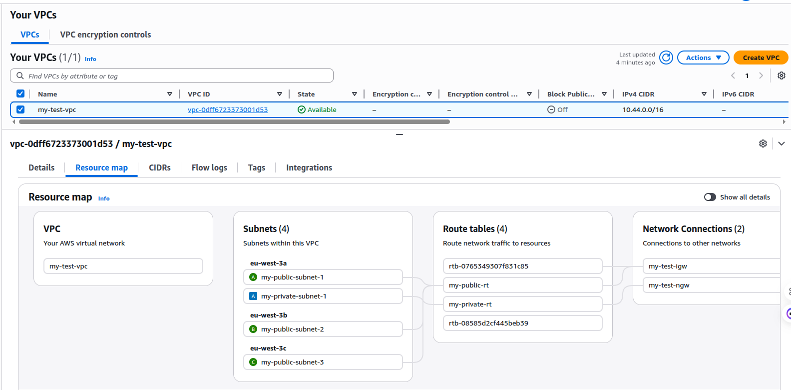
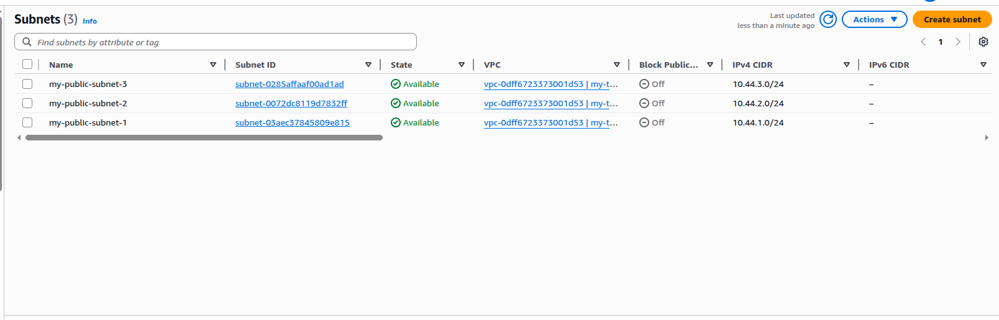
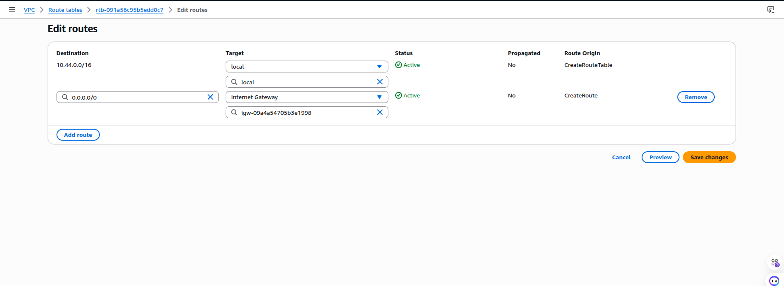
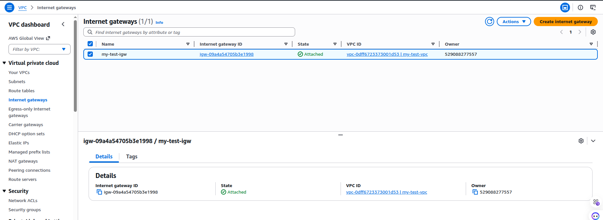
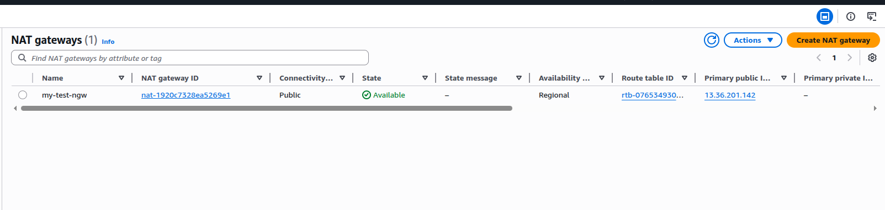
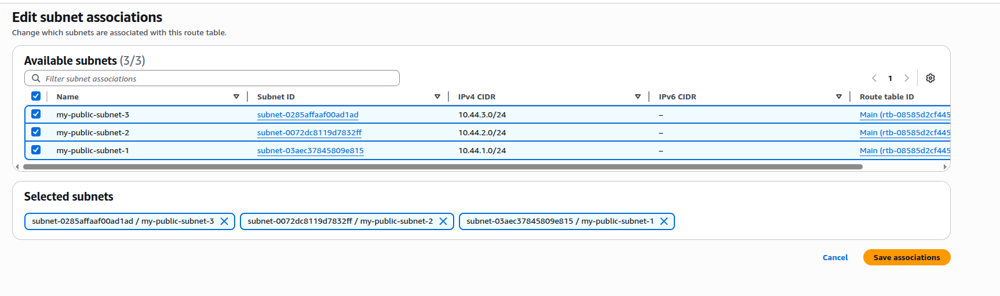
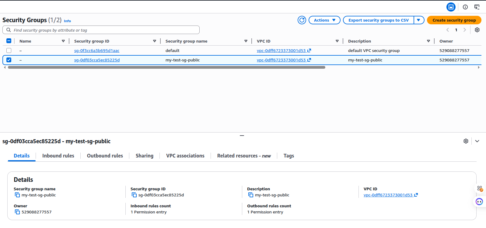
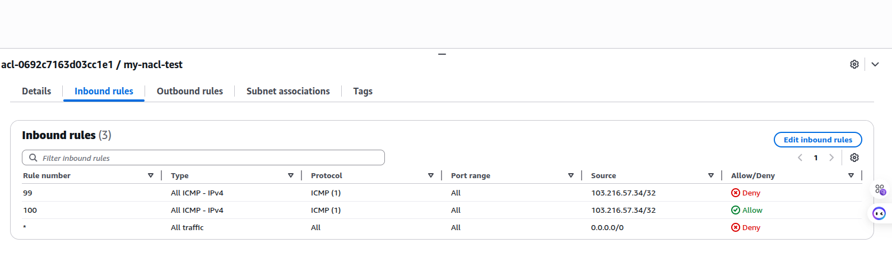
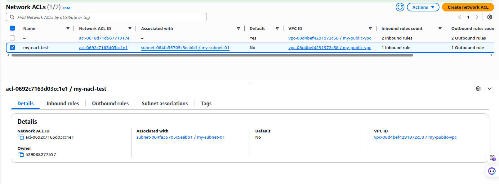

# VPC & Networking
Last modified: 18 Mar 2026

## Topics Covered
- VPC, CIDR, subnets, route tables, IGW
- Public vs private networking basics
- Security groups and access patterns
- NAT Gateway for outbound internet
- Network ACL (NACL)

## VPC and CIDR
- **VPC (Virtual Private Cloud)**: A logically isolated network in AWS where you define your IP range and network setup.
  - Example: Create a VPC with CIDR `10.0.0.0/16`.
- **CIDR Range**: IP address block that defines the size of a network.
  - Example: `10.0.0.0/16` gives 65,536 IPs.



## CIDR and Basic Networking (Quick Math)
- **CIDR format**: `IP/prefix` where prefix is number of network bits.
  - Example: `10.0.0.0/16` means first 16 bits are network, remaining 16 bits are host.
- **Total IPs**: `2^(32 - prefix)` for IPv4.
  - Example: `/24` → `2^(32-24) = 256` IPs.
- **Usable IPs in AWS**: Total minus 5 reserved by AWS.
  - Example: `/24` → 256 total, 251 usable.
- **Common sizes**:
  - `/16` → 65,536 total (65,531 usable)
  - `/20` → 4,096 total (4,091 usable)
  - `/24` → 256 total (251 usable)
- **Subnetting example**: Split `10.0.0.0/16` into four `/18` subnets.
  - `10.0.0.0/18`
  - `10.0.64.0/18`
  - `10.0.128.0/18`
  - `10.0.192.0/18`
- **Public/private split example**:
  - Public: `10.0.1.0/24`, `10.0.2.0/24`
  - Private: `10.0.101.0/24`, `10.0.102.0/24`

## Subnets
- **Subnet**: A smaller network inside a VPC. Each subnet lives in one AZ.
  - Example: Split `10.0.0.0/16` into:
  - Public subnet: `10.0.1.0/24` (AZ-a)
  - Private subnet: `10.0.2.0/24` (AZ-a)
  - Another public subnet: `10.0.3.0/24` (AZ-b)
  - Another private subnet: `10.0.4.0/24` (AZ-b)
- **Public Subnet**: Has a route to the Internet via an Internet Gateway.
- **Private Subnet**: No direct route to the Internet.



## Why Public vs Private Subnet (Not Just a Name)
- **Public subnet**: Route table includes `0.0.0.0/0 -> IGW`. Instances can be reachable from the internet if they have a public IP and security group allows.
- **Private subnet**: No IGW route in its route table. Instances are not directly reachable from the internet.
- **Why we need both**:
  - **Public** for web servers, bastion hosts, load balancers.
  - **Private** for databases, internal services, backend systems.
  - **Outbound only** for private subnets is done via a NAT Gateway in a public subnet.

## Route Tables
- **Route Table**: Controls where network traffic is directed.
  - Example public route table:
  - `10.0.0.0/16 -> local`
  - `0.0.0.0/0 -> Internet Gateway (IGW)`
  - Example private route table:
  - `10.0.0.0/16 -> local`



## Internet Gateway (IGW)
- **IGW**: Allows internet access for resources in public subnets.
  - Example: Attach IGW to VPC, then add `0.0.0.0/0` to the public route table.



## EC2 and IPs
- **EC2**: Virtual server instance you launch inside a subnet.
- **Private IP**: Internal IP used inside the VPC.
  - Example: `10.0.1.10`
- **Public IP**: Internet‑reachable IP assigned to an instance in a public subnet.
  - Example: `3.88.x.x`
- **Elastic IP (EIP)**: Static public IP you can attach to an instance so it doesn’t change.

## Access and Security
- **Key Pair**: Used to SSH into EC2.
  - Example: `ssh -i my-key.pem ec2-user@3.88.x.x`
- **Security Group**: Virtual firewall attached to instances.
  - **Inbound Rules**: Control incoming traffic.
    - Example: Allow `SSH (TCP 22)` from your IP.
  - **Outbound Rules**: Control outgoing traffic.
    - Example: Allow all outbound.


## Associations (Important)
- **Public subnet → Public route table** (route to IGW).
- **Private subnet → Private route table** (no IGW route).

## NAT Gateway
### Why NAT Gateway
- Private EC2 should not be publicly reachable.
- Private EC2 still needs outbound internet for updates/packages.
- NAT Gateway gives **outbound internet** to private subnet without exposing inbound access.

### Architecture (What I Built)
- **Public subnet**:
  - Public EC2 (has public IP)
  - NAT Gateway (with Elastic IP)
- **Private subnet**:
  - Private EC2 (no public IP)
- **Routing**:
  - Public route table: `0.0.0.0/0 -> Internet Gateway (IGW)`
  - Private route table: `0.0.0.0/0 -> NAT Gateway`

### NAT Gateway Setup Steps
1. Create/confirm an **Internet Gateway** and attach it to VPC.
2. Ensure public subnet route table has:
   - `VPC-CIDR -> local`
   - `0.0.0.0/0 -> IGW`
3. Create an **Elastic IP (EIP)**.
4. Create **NAT Gateway** in the **public subnet** and attach EIP.
5. In private route table, add:
   - `0.0.0.0/0 -> NAT Gateway`
6. Associate this private route table with private subnet.





### Access Private Server from Public Server
#### Security Group Rules
- **Public SG (public EC2)**:
  - Inbound SSH `22` from **your laptop public IP**.
- **Private EC2 SG**:
  - Inbound SSH `22` from **Public SG** (recommended), or public EC2 private IP.



#### Key File Copy + SSH Flow
From your laptop, copy private instance key to public EC2:

```bash
scp -i public-ec2-key.pem private-key.pem ubuntu@<public-ec2-public-ip>:/home/ubuntu/
```

SSH into public EC2:

```bash
ssh -i public-ec2-key.pem ubuntu@<public-ec2-public-ip>
```

Inside public EC2, set permission and connect private EC2:

```bash
chmod 400 private-key.pem
ssh -i private-key.pem ubuntu@<private-ec2-private-ip>
```

### Validate NAT from Private EC2
After logging into private EC2, test outbound internet:

```bash
sudo apt update && sudo apt upgrade -y
```

If updates work, private route table + NAT association is correct.

### Common Issues Checklist
- NAT Gateway must have an **Elastic IP**.
- Private subnet must be associated with **private route table**.
- Private route table must have default route to **NAT Gateway**.
- Security Group of private EC2 must allow SSH from public EC2 SG.
- Key file permission should be `400`.

## NACL and Security Groups
NACL (Network ACL) and Security Group (SG) are both AWS network security layers, but they work differently.

- NACL works at the subnet level and is stateless.
- Security Group works at the instance level and is stateful.
- NACL supports both allow and deny rules.
- Security Group supports allow rules only (no explicit deny).
- NACL can filter traffic by specific IP or CIDR ranges.

### How NACL Rule Numbers Work
- Rule numbers define the order of evaluation (lowest number first).
- AWS checks rules from low to high and stops at the first match.
- The first matching rule is applied (ALLOW or DENY).
- Keep number gaps like 100, 200, 300 so new rules can be inserted later.

Example:
- Rule 99: DENY ICMP from `0.0.0.0/0`
- Rule 100: ALLOW ICMP from `0.0.0.0/0`
- Result: traffic is denied because rule 99 is matched first.

### SG Allow (No NACL Restriction)
In this step, the Security Group allows ICMP/ping traffic. Since no restrictive NACL rule is applied yet, connectivity works.


### NACL Inbound Rule
Here, the inbound NACL rule is configured to control incoming traffic at the subnet level.



### NACL Outbound Rule
NACL rule configuration, which controls subnet-level outgoing traffic.


### NACL Subnet Association
After creating the NACL rules, the NACL is associated with the target subnet so the rules can take effect.



### Result After NACL Rule Applied
Final result: after applying restrictive NACL rules, ping traffic is blocked. This demonstrates that NACL can explicitly deny traffic, unlike Security Groups.


