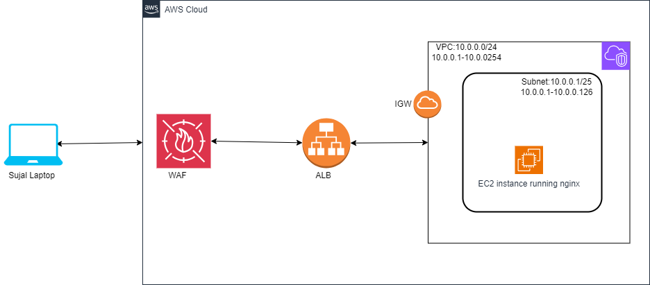

# WAF - Web Application Firewall
Last modified: 19 Apr 2026

## What is WAF?
WAF (Web Application Firewall) is AWS's service for **protecting web applications from common web exploits**.  
It monitors and controls HTTP/HTTPS requests to your web applications.

- Protects against SQL injection, XSS, and other attacks
- Integrates with CloudFront, ALB, and API Gateway
- Uses rules to filter malicious traffic
- Supports custom rules and managed rule groups

### Basics of WAF
The image below shows how WAF fits into your web application architecture.

---

## Why do we need WAF?
We use WAF to protect our web applications from layer 7 attacks that traditional firewalls miss.

Common use cases:
- Protect e-commerce sites from SQL injection
- Block malicious bots and scrapers
- Implement rate limiting to prevent DDoS
- Filter traffic based on geographic location
- Comply with PCI DSS and other security standards

Benefits:
- Real-time protection against web exploits
- Reduced false positives with managed rules
- Integration with AWS services
- Detailed logging and monitoring

---

## How WAF works (simple flow)
1. Create a Web ACL with rules and rule groups
2. Associate the Web ACL with a CloudFront distribution or ALB
3. WAF inspects incoming requests against rules
4. Allowed requests pass through, blocked requests are rejected
5. Logs are sent to CloudWatch or S3 for analysis

After configuration, malicious traffic is automatically blocked before reaching your application.

> Important: WAF operates at the **application layer (Layer 7)**.  
> It complements network-level protections like Security Groups and NACLs.

---
